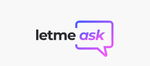
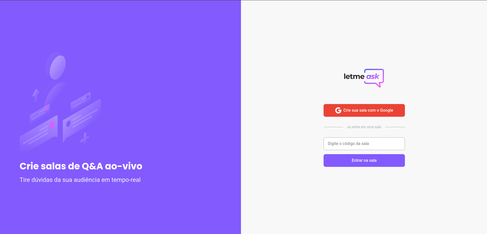
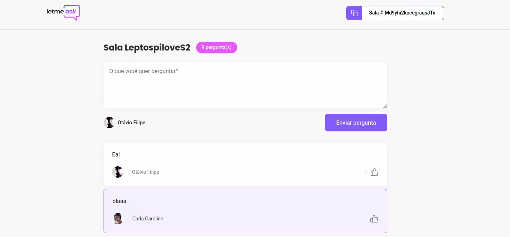
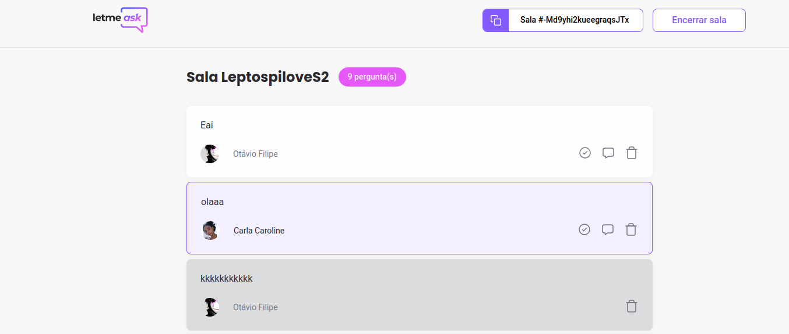

# Letmeask 

is a project created in a react.js class through nlw 6.
This project aims to create a question room where the respondent can answer the most voted questions, can highlight and delete the answered questions.

this project uses google firebase database.

User interface images.

Admin interface and interaction.